# 🛡️ Razorpay AI Risk Manager

**Razorpay Buildathon 2026 Submission**
*An AI-powered dispute & fraud-risk intelligence platform for merchants*

## 🎥 Project Demo

▶️ **[Watch the Project Demo on YouTube](https://www.youtube.com/watch?v=3cHDvWRjT7s)**

## 📊 Project Presentation

📑 **[View / Download Presentation](./docs/presentation.pptx)**

---

## 1. 🏆 Executive Summary

Chargeback and dispute management is one of the most operationally painful parts of running a payments business. Merchants have to manually assemble evidence, judge whether it's strong enough, and guess their odds — usually under a tight deadline and with no data-driven support.

**Razorpay AI Risk Manager** is an end-to-end dispute intelligence platform that combines:

- **Machine learning fraud risk scoring** on transactions
- **AI-powered evidence analysis** (DeepSeek LLM) that reads uploaded evidence and flags gaps or contradictions
- **A win-probability model** to help merchants judge their odds before submission
- **A full merchant workflow** — from dispute intake through evidence collection, AI/ML-assisted review, gateway review, and final outcome, integrated with Razorpay's dispute webhook flow

The core innovation is bringing structured ML risk scoring and unstructured LLM evidence reasoning into a **single decision-support workflow**, so merchants aren't fighting disputes blind.

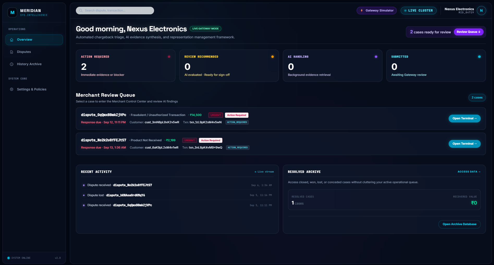
*The main dashboard — merchant's entry point into fraud risk and dispute intelligence.*

---

## 2. 🎯 Problem

Merchants dealing with payment disputes today typically face:

- **Manual evidence assembly** — digging through emails, receipts, and shipment records under deadline pressure
- **No risk visibility** — no signal on which transactions are fraud-prone before a dispute even happens
- **No evidence quality feedback** — merchants submit whatever they have, with no idea if it's complete or convincing
- **No outcome guidance** — decisions on whether to fight or concede a dispute are made on gut feel, not probability

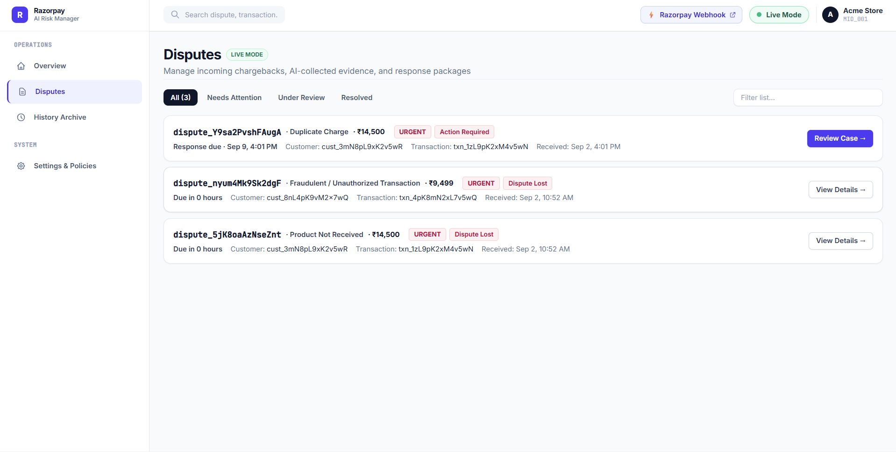
*The scale of the problem — a merchant's dispute portfolio, each case demanding manual attention.*

This is a real, well-understood pain point in payments operations, and it scales badly — the more transaction volume a merchant has, the more this becomes an unmanageable manual process.

---

## 3. 💡 Solution

Razorpay AI Risk Manager was built as an integrated platform rather than a set of disconnected tools:

- A **React frontend** gives merchants a unified dashboard for risk, disputes, and evidence
- A **FastAPI backend** with a clean service/repository architecture powers 50+ endpoints
- An **11-table relational schema** models disputes, evidence, assessments, and workflow state
- Two **ML models** (fraud risk, win probability) built on XGBoost provide predictive signal
- A **DeepSeek LLM integration** reads evidence and produces structured, grounded analysis — completeness gaps, contradictions, and recommendations — rather than free-form text

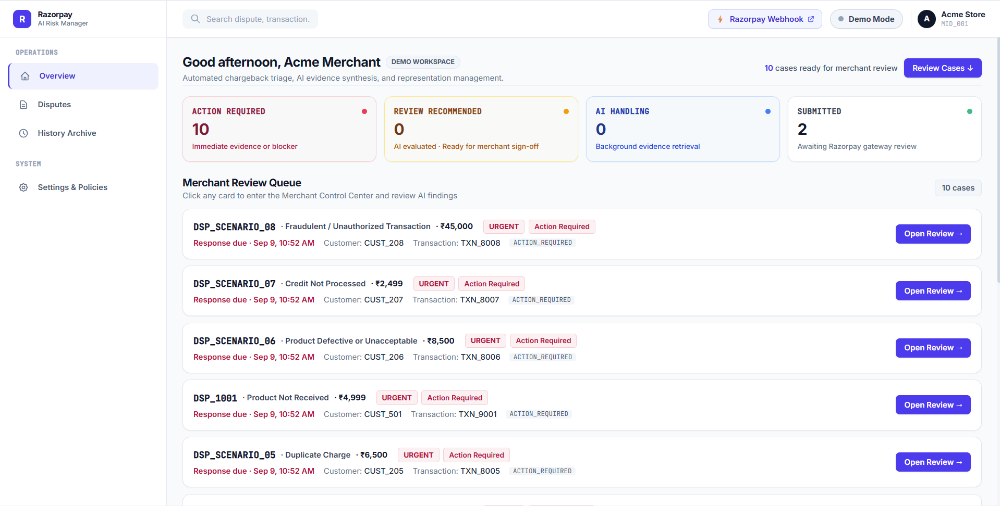
*The unified platform in demo mode — risk, disputes, and evidence in one place.*

The reasoning for combining ML + LLM: fraud scoring alone tells you *risk*, but not *whether your evidence can win the dispute*. Evidence analysis alone tells you about a single case, but not the underlying transaction risk pattern. Together, they give a merchant a genuinely more complete picture.

---

## 4. 🚀 Key Achievements

| Achievement | What Was Built |
|---|---|
| End-to-End Dispute Workflow | Complete merchant dispute journey from intake to outcome |
| Fraud Intelligence | ML-powered transaction risk scoring (XGBoost) |
| AI Evidence Analysis | DeepSeek-powered evidence intelligence with grounding rules |
| Evidence Enrichment | External evidence connectors + manual evidence addition |
| Human-in-the-Loop Review | Merchant-controlled decision workflow, gateway review step |
| Decision Support | Win-probability model feeding into the review stage |
| Persistence | Full dispute/evidence/assessment state stored in an 11-table schema |
| Integration | Razorpay dispute webhook workflow |
| Input Validation | Pydantic-based validation across all API inputs |
| Error Handling | Clean error responses; no stack traces leaked to clients |

---

## 5. 🖥️ Product Walkthrough

**Dashboard → Dispute Portfolio → Raise / Open Dispute → Dispute Overview → Lifecycle → Evidence → ML + AI → Gateway Review → Final Outcome → Integration**

### Dashboard

*Merchant's fraud-risk and dispute command center — the entry point for every workflow below.*

### Dispute Portfolio

*The merchant's dispute list — all open and historical cases summarized for quick triage.*


*Demo-mode dispute environment used to showcase the workflow end-to-end.*

### Raise / Open Dispute
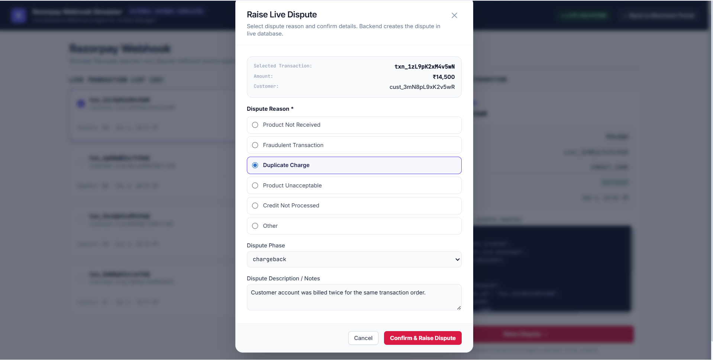
*The intake flow where a new dispute case is created and tied to the underlying transaction.*

### Dispute Overview
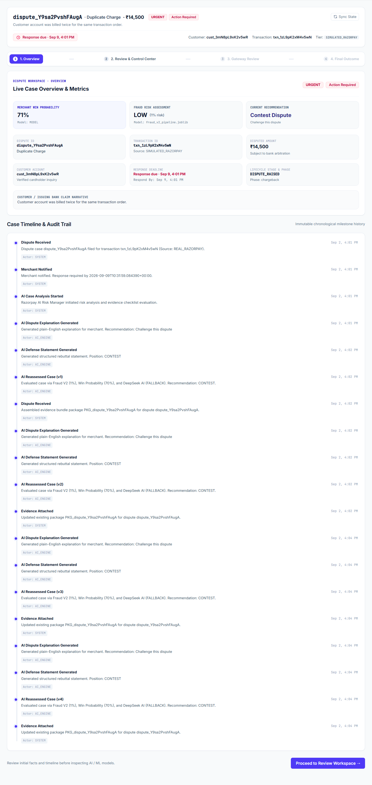
*A single dispute's full detail view — status, transaction context, and case summary.*

### Dispute Lifecycle
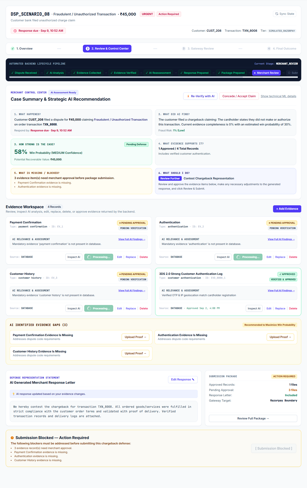
*How a live dispute record and its lifecycle state connect in a single view.*

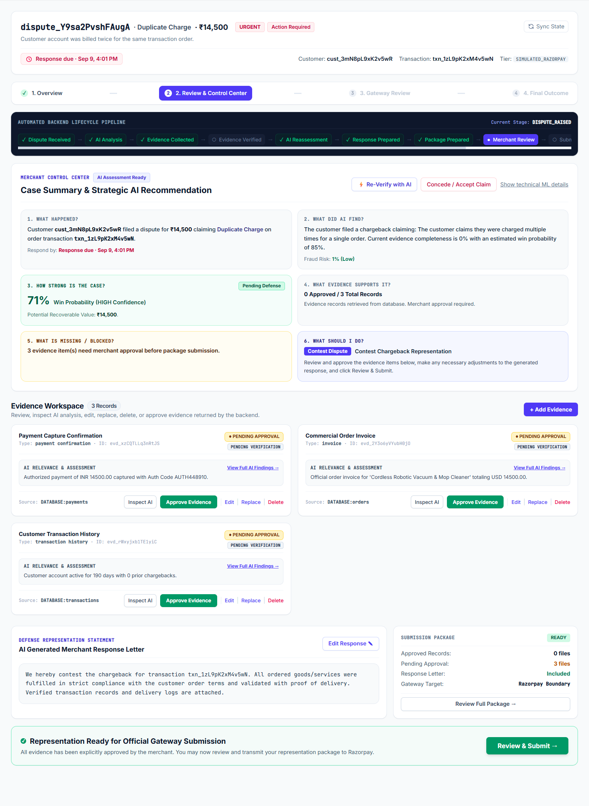
*The dispute lifecycle state machine — the stages a case moves through from creation to resolution.*

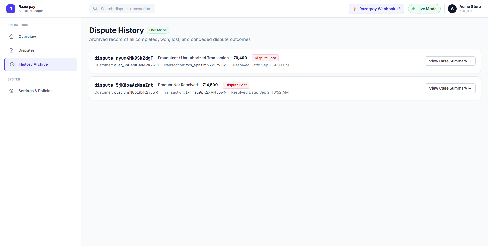
*Full event history for a dispute — a timeline of every action and status change, giving the merchant an audit trail.*

### Evidence Collection & External Evidence
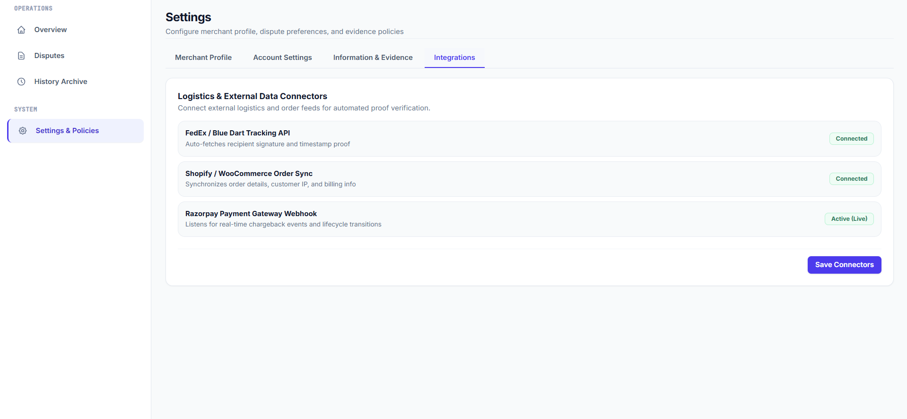
*External evidence connector interface, for pulling supporting evidence from outside sources.*

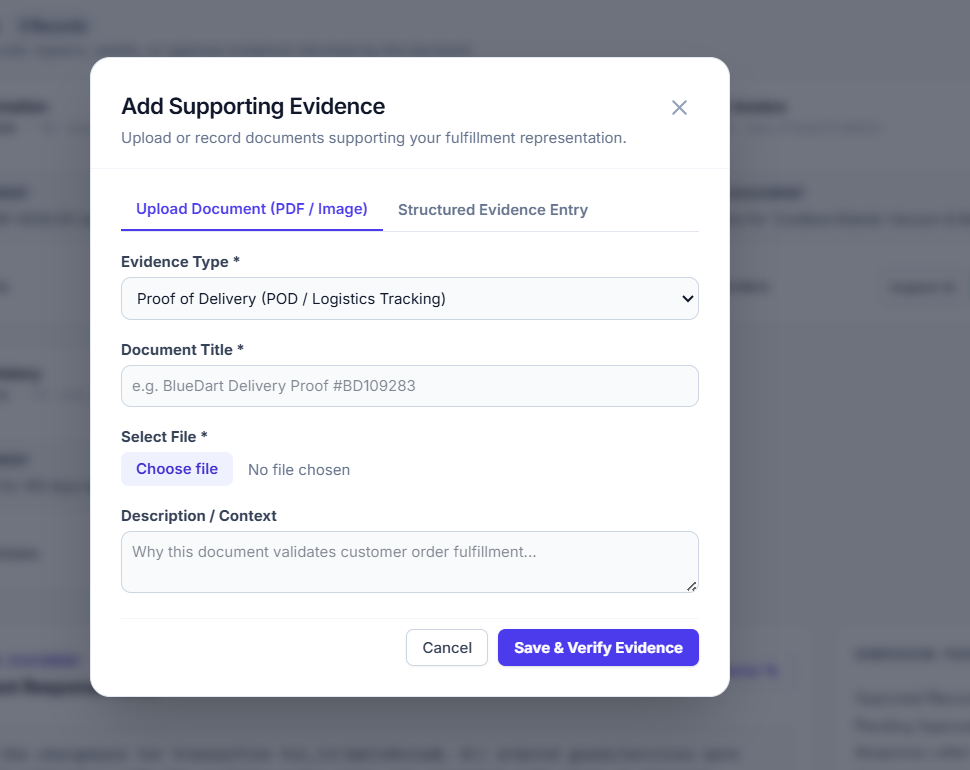
*The manual evidence-addition flow, where merchants attach documents to a dispute case.*

### ML + AI Analysis
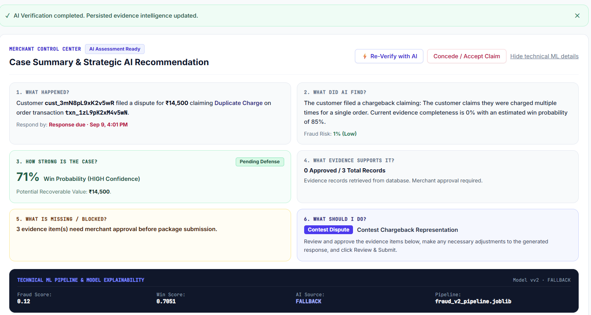
*Combined machine-learning risk score and AI evidence assessment, shown together for the first time in one interface.*

### Gateway Review
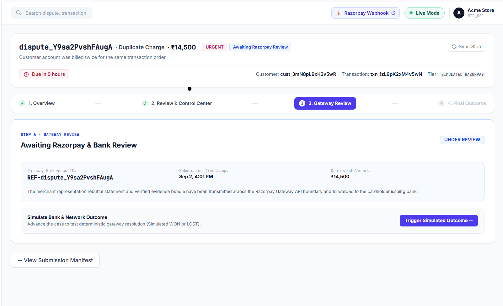
*The review checkpoint where the AI/ML assessment is surfaced to the merchant before submission.*

### Final Outcome
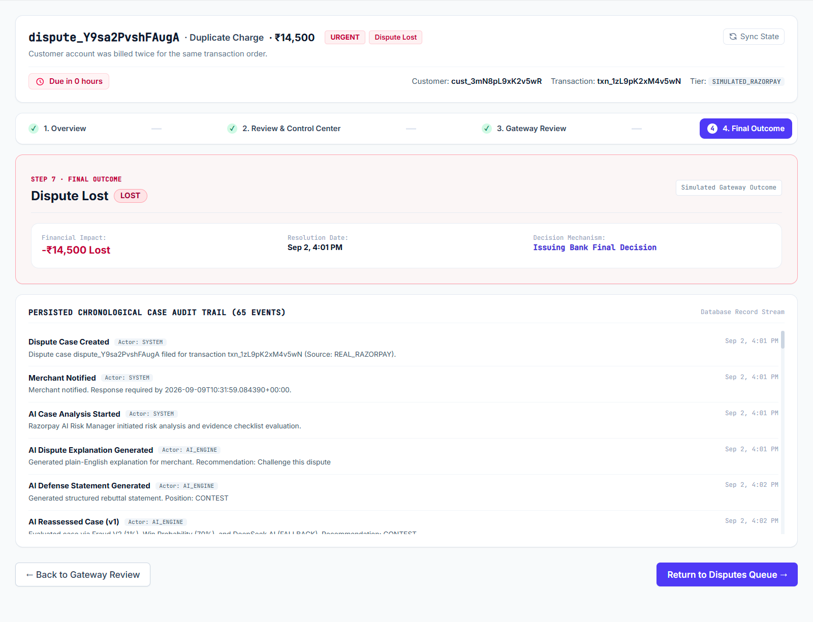
*The resolved state of a dispute case, showing the final decision.*

### Integration

*The Razorpay webhook integration point, where dispute events flow into the platform.*

---

## 6. 🧠 Intelligence Layer

### Fraud ML
An XGBoost-based fraud risk model scores transactions to flag risk before or alongside a dispute. The model loads and produces inference correctly in the current build.

### Win-Probability / Decision Intelligence
A second XGBoost model estimates the merchant's probability of winning a dispute given its current evidence state, intended to guide the "fight vs. concede" decision at the gateway review stage.

### DeepSeek AI
The evidence-analysis pipeline sends structured evidence context to DeepSeek with grounding rules designed to reduce hallucination — the model is prompted to identify completeness gaps and contradictions rather than freely generate claims. When DeepSeek is unavailable, the system is designed to fail gracefully rather than block the workflow.

### AI + ML Interaction
The fraud score, win-probability estimate, and DeepSeek evidence analysis converge at the **Gateway Review** step, so the merchant sees risk, odds, and evidence quality side by side rather than as three disconnected signals.


*ML risk output and AI evidence analysis in the same interface — the core intelligence layer of the product.*


*Where ML risk, win probability, and AI evidence analysis converge for the merchant's decision.*

---

## 7. 📎 Evidence Intelligence

Evidence handling is central to the platform's value: it's not enough to store files, the system tries to actively assess them.

- **Evidence upload** — files are accepted, validated, and stored against the dispute record
- **Text extraction** — PDF evidence is extracted successfully for AI analysis
- **External evidence connectors** — a dedicated interface for pulling in supporting evidence from outside sources
- **Manual evidence addition** — merchants can directly attach documents
- **AI completeness & contradiction detection** — DeepSeek analysis flags what's missing or inconsistent in the evidence set


*Evidence enrichment via external connectors — evidence doesn't have to originate only from manual upload.*


*Manual evidence addition to a dispute case.*

**Current limitation, stated plainly:** image-based evidence (e.g., scanned receipts) has no OCR library wired in yet, so text extraction currently only works reliably for PDF/text evidence. This is tracked in the roadmap below rather than glossed over, since it directly affects what evidence types the AI can actually reason about today.

---

## 8. ⚖️ Decision & Human Review

The platform is explicitly designed as **human-in-the-loop**, not autonomous decisioning:

1. AI evidence analysis and ML scores are generated
2. The merchant reviews them at the **Gateway Review** stage
3. The merchant makes the final call
4. The outcome is recorded on the dispute record


*Merchant-facing review checkpoint before submission.*


*The recorded final outcome of a dispute case.*

This design choice matters for a fintech context: the AI supports the merchant's judgment, it doesn't replace it.

---

## 9. 🏗️ System Architecture

### High-Level Architecture

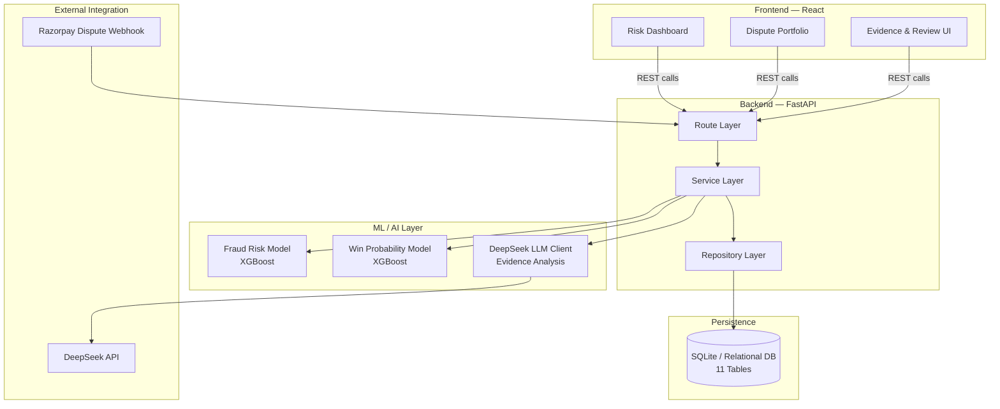

### Component Breakdown

**Frontend (React)**
- Dashboard, dispute portfolio, dispute detail, evidence, and review views
- Talks to the backend exclusively over REST

**Backend (FastAPI)**
- **Route layer** — 50+ endpoints, request validation via Pydantic
- **Service layer** — business logic: dispute state transitions, evidence orchestration, ML/AI invocation
- **Repository layer** — isolates SQLAlchemy data access from business logic

**Persistence**
- 11-table relational schema covering disputes, evidence, assessments, transactions, and workflow events
- Indexed on primary lookup fields (dispute ID, transaction ID)

**ML / AI Layer**
- **Fraud Risk Model** — XGBoost, scores transactions for fraud likelihood
- **Win-Probability Model** — XGBoost, estimates odds of a successful dispute outcome given current evidence
- **DeepSeek Client** — sends structured evidence context, grounding rules applied in-prompt, handles API errors gracefully

**External Integration**
- Razorpay dispute webhook feeds dispute events into the platform
- DeepSeek API called out-of-process for evidence reasoning

### Evidence Pipeline

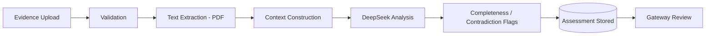

### Dispute Lifecycle State Machine

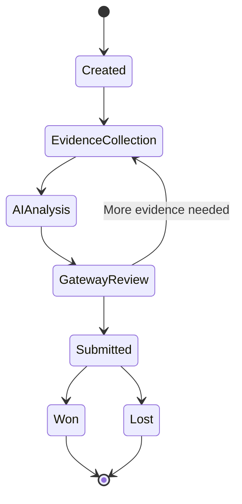

---

## 10. 🔌 API & Database

- **50+ endpoints** covering disputes, evidence, assessments, ML scoring, and AI analysis
- **Pydantic** request/response validation on all inputs
- **CORS** configured correctly for local development
- Clean error handling — failures return structured errors, not stack traces
- **11-table schema** with a documented ER structure, indexing on key lookup fields, and a repository pattern separating data access from business logic

### Representative Endpoint Latencies (development machine, unverified at scale)

| Endpoint | Typical | Range | Notes |
|---|---|---|---|
| `GET /disputes` | 50–100ms | 50–2000ms | Slower on larger datasets — see roadmap |
| `GET /disputes/{id}` | 10–20ms | 10–50ms | Single-record fetch |
| `POST /disputes/{id}/evidence` | 1–3s | 500ms–30s | Includes file processing + DeepSeek call |
| `GET /disputes/{id}/analysis` | 2–5s | 2–30s | Full analysis pipeline, DeepSeek-dependent |
| `POST /ai/analyze-evidence` | 1–3s | 500ms–30s | DeepSeek API dependent |

---

## 11. 🔐 Security

Implemented today:

- Pydantic-based input validation across all endpoints
- CORS configured correctly for the development environment
- Error handling that avoids leaking stack traces or internal details
- Evidence file upload validation

**Stated plainly, because it matters for a fintech tool:** in its current buildathon state, the platform does **not** have authentication or authorization — all endpoints are currently open — and API keys are stored in local config rather than a secrets vault. The database is unencrypted, and the app runs over HTTP in this environment. These are exactly the controls that would need to be added before any production or real-merchant-data use, and they're treated as **Priority 1 production-hardening work**, not hidden or minimized here.

**AI safety:** the DeepSeek integration is prompted with grounding rules intended to keep output tied to actual evidence content and reduce hallucinated claims. Adversarial/prompt-injection testing has not yet been run against it — that's listed under Testing below.

---

## 12. 📊 Metrics & Evaluation

The fraud model and win-probability model are integrated end-to-end into the workflow and produce inference correctly in the current build.

### Current Achievement

Both models are built on XGBoost, loaded into the live service, and produce inference against real dispute/transaction records as part of the workflow — the ML layer is not a stub, it's wired into the actual decision path the merchant sees at Gateway Review.

### Fraud Model V2 — Reproduced Evaluation Metrics
*(as reported by the project team)*

| Metric | Value |
|---|---|
| ROC-AUC | 0.9841 |
| PR-AUC | 0.8559 |
| Precision @ 0.75 | 0.7534 |
| Recall @ 0.75 | 0.8333 |
| F1 @ 0.75 | 0.7914 |
| Brier Score | 0.0404 |

**Confusion Matrix (held-out test set)**

| | Predicted: Not Fraud | Predicted: Fraud |
|---|---|---|
| **Actual: Not Fraud** | TN: 660 | FP: 18 |
| **Actual: Fraud** | FN: 11 | TP: 55 |

**Held-out test set:** 744 samples (66 fraud cases)

### Win Probability Model — Reproduced Evaluation Metrics
*(as reported by the project team)*

| Metric | Value |
|---|---|
| ROC-AUC | 0.8688 |
| PR-AUC | 0.9406 |
| Precision | 0.8739 |
| Recall | 0.9448 |
| F1 | 0.9080 |
| Brier Score | 0.1125 |

**Test set:** 400 samples

> **Attribution note:** these figures are reported by the project team as reproduced evaluation results. They're labeled "as reported" rather than "independently verified" because this audit did not have direct access to the underlying evaluation script, notebook, or run log — if that artifact is checked into the repo (recommended below), this note can be updated to cite it directly and the label changed to "verified."

### Future Implementation

- Check the evaluation script/notebook into the repo so the metrics above can be independently reproduced and cited directly
- Evidence-analysis completeness/contradiction accuracy benchmarking
- DeepSeek hallucination-rate measurement against a labeled evidence set
- Frontend automated test coverage
- Dispute-listing performance benchmarking at scale (1000+ disputes)

---

## 13. 🧬 Engineering Journey

**Idea → Core Product → Dispute Workflow → ML Intelligence → AI Integration → Evidence Intelligence → Merchant Review → Integration → Testing & Hardening → Final Buildathon System**

The project moved from a basic dispute tracker concept to a full ML + LLM-assisted decision-support platform, with the evidence pipeline and gateway review step added specifically to keep a human decision-maker in the loop rather than letting the AI output stand alone.

---

## 14. 🐛 Challenges → Fixes → Achievements

### Evidence Context Challenge
**Challenge:** Early evidence-analysis attempts fed DeepSeek loosely structured evidence, producing inconsistent output.
**Investigation:** The team traced this to a lack of structured context construction before the LLM call.
**Fix:** The evidence context pipeline was redesigned to organize dispute and evidence data into a consistent structure before analysis, paired with explicit grounding rules in the prompt.
**Result:** A more consistent, structured AI analysis output feeding directly into the merchant review step.

### Graceful Degradation Challenge
**Challenge:** The DeepSeek API is an external dependency and won't always be available.
**Investigation:** The system needed a fallback path so a downed external API wouldn't block the entire dispute workflow.
**Fix:** The DeepSeek client was built to handle errors gracefully rather than propagate failures into the UI.
**Result:** The dispute workflow remains usable even if AI analysis is temporarily unavailable — though full automated fallback-quality testing is still a roadmap item.

---

## 15. 🏆 What We Achieved

- A working, end-to-end dispute management **product**, not just a demo shell
- **ML fraud risk scoring** integrated directly into the workflow
- **AI evidence analysis** with grounding rules aimed at reducing hallucination
- A genuine **evidence intelligence layer** — upload, extraction, external connectors, gap/contradiction detection
- A **human-in-the-loop decision workflow** ending in a recorded final outcome
- A clean **FastAPI + React + SQLAlchemy** architecture with a documented 11-table schema and 50+ endpoints
- Honest self-assessment of what still needs work before production


*The full audit trail of a completed dispute — evidence of the workflow operating end-to-end.*

---

## 16. 🚀 Future Roadmap

**Production Hardening**
- Add authentication (JWT) and authorization across all endpoints
- Move API keys into a proper secrets vault
- Add database encryption and enforce HTTPS
- Add API rate limiting

**AI/ML Improvements**
- Run and document formal fraud-model evaluation (ROC-AUC, PR-AUC, precision/recall, calibration)
- Adversarial and prompt-injection testing against the DeepSeek pipeline
- Add OCR support for image-based evidence

**Testing & Reliability**
- Build out frontend automated test coverage
- Load-test the dispute-listing query path at 1000+ disputes and optimize as needed
- Formalize the DeepSeek fallback path with dedicated tests

**Integration & Scale**
- Move from simulated dispute data to live, read-only Razorpay dispute integration
- Add observability/metrics collection
- Docker/deployment configuration for production environments

---

## 17. 📦 Setup & Reproducibility

```bash
# Clone the repository
git clone <repo-url>
cd razorpay-ai-risk-manager

# Backend setup
cd backend
python -m venv venv
source venv/bin/activate       # Windows: venv\Scripts\activate
pip install -r requirements.txt

# Environment variables
cp .env.example .env
# Set DEEPSEEK_API_KEY and any other required values in .env

# Database initialization
python init_db.py

# Start backend
uvicorn main:app --reload

# Frontend setup (separate terminal)
cd frontend
npm install
npm run dev
```

Adjust script/file names above to match the actual repository layout if they differ — this section should be updated with the real commands from the project once confirmed against the codebase.

---

## 18. 📚 Documentation

Full technical documentation for this project:

- **System Architecture** — complete design, diagrams, data flow, ML pipeline
- **Database Architecture** — full schema, ER diagram, indexing strategy
- **API Documentation** — all 50+ endpoints with request/response schemas
- **Security Audit** — full assessment of implemented, missing, and at-risk controls
- **Project Truth Report** — an independent, source-code-based audit distinguishing what's verified, partially working, and not yet implemented

---

## 19. 👨‍💻 Built By

**Gurram Jagan Bhasker**
Project created for **Razorpay Buildathon 2026**

- **LinkedIn:** [linkedin.com/in/gurramjaganbhasker](https://www.linkedin.com/in/gurramjaganbhasker/)
- **Email:** [jaganbhaskergurram@gmail.com](mailto:jaganbhaskergurram@gmail.com)
- **GitHub:** [github.com/Jaganbhasker1122](https://github.com/Jaganbhasker1122)

---

## 20. ❤️ Final Statement

Razorpay AI Risk Manager was built to tackle a real, tedious, high-stakes problem in payments: helping merchants navigate disputes with actual data-driven support instead of guesswork. It combines fraud ML scoring, LLM-based evidence reasoning, and a merchant-controlled review workflow into one coherent product — end to end, from dispute intake to final outcome.

It isn't finished — authentication, formal model evaluation, and OCR support are real, named next steps rather than hidden gaps — but the core workflow works, the architecture is clean, and the ML + AI combination is a genuinely useful idea for this problem space. That combination of **a working product today** and **an honest, concrete path to production** is what this submission is meant to demonstrate.


*The dispute lifecycle, connected end-to-end into the Razorpay ecosystem.*
