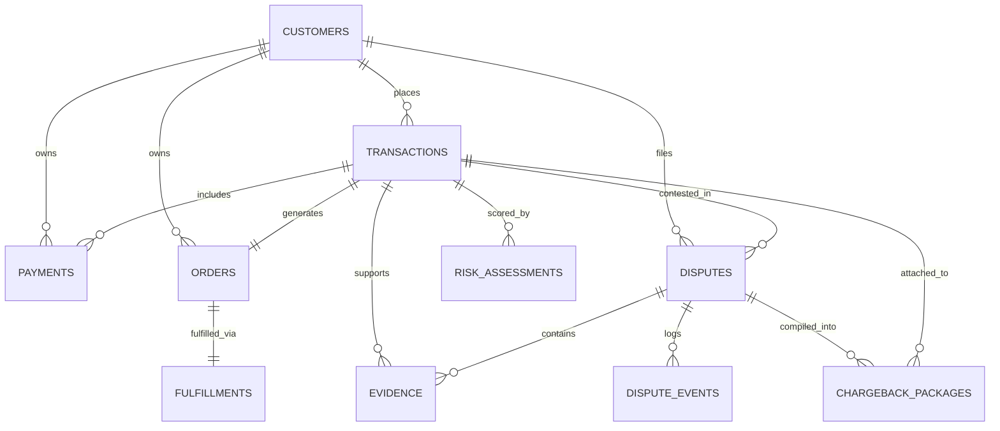

# DATABASE SCHEMA & DEMO DATA ARCHITECTURE SPECIFICATION
## Razorpay AI Risk Manager — Merchant-First AI Chargeback Operations Platform

> **AUTHORITATIVE DATABASE & DEMO DATA REFERENCE**  
> *This document provides an exhaustive, full-stack reference for the database architecture, table schemas, entity relationships, 3-tier data isolation model, and seeded demonstration datasets in the Razorpay AI Risk Manager platform.*

---

## 1. ARCHITECTURAL OVERVIEW

The persistence layer is powered by **SQLAlchemy ORM** backed by **SQLite** (`data/app_database.db`). It is designed for multi-threaded FastAPI execution, continuous AI Autopilot recalculation, and strict dispute isolation.

```text
┌────────────────────────────────────────────────────────────────────────────────────────┐
│                                 PERSISTENCE ARCHITECTURE                               │
├────────────────────────────────────────────────────────────────────────────────────────┤
│                                                                                        │
│   FastAPI Request Layer (Session Dependency: get_db)                                  │
│         │                                                                              │
│         ▼                                                                              │
│   SQLAlchemy SessionLocal (connect_args: {"check_same_thread": False})                 │
│         │                                                                              │
│         ▼                                                                              │
│   Auto-Migration & Seeding Engine (init_db -> _run_migrations -> seed_database_if_empty)│
│         │                                                                              │
│         ▼                                                                              │
│   SQLite Database File (data/app_database.db)                                          │
│                                                                                        │
└────────────────────────────────────────────────────────────────────────────────────────┘
```

### 3-Tier Data Architecture
To guarantee strict isolation between demonstration data, live local testing, and future external webhooks, all dispute records are categorized via `case_source`:

| Data Tier (`case_source`) | Description | Target Use Case |
| :--- | :--- | :--- |
| `DEMO` | Pre-seeded showcase scenarios (11 cases) with diverse dispute reasons and states. | Platform demonstration, test suites, and UI exploration. |
| `SIMULATED_RAZORPAY` | Dynamic chargebacks generated locally via the `/demo` simulation console. | Interactive merchant end-to-end testing and real-time AI evaluation. |
| `REAL_RAZORPAY` | Reserved tier for live external Razorpay Webhook ingestion. | Production integration boundary. |

---

## 2. ENTITY-RELATIONSHIP DIAGRAM (ERD)



---

## 3. COMPLETE DATABASE SCHEMA REFERENCE

### 3.1. `customers` Table
Represents customer account profiles, behavioral history, and baseline risk indicators.

| Column | Type | Primary/Foreign Key | Default / Nullable | Description |
| :--- | :--- | :--- | :--- | :--- |
| `customer_id` | `VARCHAR` | **PRIMARY KEY**, Index | Not Null | Unique customer identifier (e.g. `CUST_LIVE_001`). |
| `account_age_days`| `INTEGER`| | `180` | Customer account age in days (used in ML scoring). |
| `verification_status`| `VARCHAR` | | `'VERIFIED'` | Identity verification status (`VERIFIED`, `UNVERIFIED`). |
| `country` | `VARCHAR` | | `'US'` | Customer account registration country ISO code. |
| `previous_chargebacks` | `INTEGER` | | `0` | Count of prior chargebacks filed by this customer. |
| `avg_transaction_amount_30d` | `FLOAT` | | `100.0` | 30-day average transaction amount in base currency. |
| `created_at` | `VARCHAR` | | UTC ISO Timestamp | Customer creation timestamp. |

---

### 3.2. `transactions` Table
Stores financial payment records alongside engineered feature parameters for ML Fraud V2 and Win Rate estimation models.

| Column | Type | Primary/Foreign Key | Default / Nullable | Description |
| :--- | :--- | :--- | :--- | :--- |
| `transaction_id` | `VARCHAR` | **PRIMARY KEY**, Index | Not Null | Unique transaction identifier (e.g. `TXN_LIVE_001`). |
| `customer_id` | `VARCHAR` | **FOREIGN KEY** (`customers.customer_id`), Index | Not Null | Reference to associated customer. |
| `merchant_id` | `VARCHAR` | | `'MERCHANT_001'` | Merchant account identifier. |
| `amount` | `FLOAT` | | Not Null | Transaction transaction value (e.g. `4999.0`). |
| `currency` | `VARCHAR` | | `'USD'` / `'INR'` | Currency code (ISO 4217). |
| `timestamp` | `VARCHAR` | | UTC ISO Timestamp | Transaction capture timestamp. |
| `payment_method` | `VARCHAR` | | `'credit_card'` | Payment instrument (`credit_card`, `debit_card`, `upi`, `netbanking`). |
| `merchant_category`| `VARCHAR` | | `'retail'` | Merchant MCC / business vertical category. |
| `transaction_country`| `VARCHAR`| | `'US'` / `'IN'` | Origin country code of the transaction. |
| `transaction_status`| `VARCHAR` | | `'SUCCESS'` | Gateway status (`SUCCESS`, `FAILED`, `REFUNDED`). |
| **ML Parameters** | | | | |
| `transaction_hour` | `INTEGER` | | `12` | Hour of the day (0–23) when transaction occurred. |
| `account_age_days` | `INTEGER` | | `180` | Snapshot of account age at transaction time. |
| `previous_chargebacks`| `INTEGER`| | `0` | Snapshot of previous dispute counts. |
| `device_type` | `VARCHAR` | | `'mobile'` | Device channel (`mobile`, `desktop`, `tablet`, `unknown`). |
| `is_international` | `INTEGER` | | `0` | Flag (0 or 1) indicating cross-border transaction. |
| `is_high_risk_merchant` | `INTEGER` | | `0` | Flag (0 or 1) indicating high-risk merchant vertical. |
| `transaction_velocity_1h` | `INTEGER` | | `0` | Transactions from same customer within past 1 hour. |
| `transaction_velocity_24h`| `INTEGER` | | `0` | Transactions from same customer within past 24 hours. |
| `avg_transaction_amount_30d`| `FLOAT` | | `100.0` | Historical customer spend benchmark. |

---

### 3.3. `payments` Table
Captures gateway payment authorization metadata, authentication protocols, and card networks.

| Column | Type | Primary/Foreign Key | Default / Nullable | Description |
| :--- | :--- | :--- | :--- | :--- |
| `payment_id` | `VARCHAR` | **PRIMARY KEY**, Index | Not Null | Unique payment ID (e.g. `PAY_LIVE_001`). |
| `transaction_id` | `VARCHAR` | **FOREIGN KEY** (`transactions.transaction_id`), Index | Not Null | Linked transaction. |
| `customer_id` | `VARCHAR` | **FOREIGN KEY** (`customers.customer_id`) | Not Null | Linked customer. |
| `payment_method` | `VARCHAR` | | `'credit_card'` | Payment channel. |
| `card_network` | `VARCHAR` | | `'visa'` | Card brand (`visa`, `mastercard`, `amex`, `rupay`, `upi`). |
| `last4` | `VARCHAR` | | `'4242'` | Masked card last 4 digits. |
| `avs_match` | `VARCHAR` | | `'Y'` | Address Verification System match code (`Y`, `N`, `P`, `U`). |
| `cvv_match` | `VARCHAR` | | `'Y'` | Card Verification Value result (`Y`, `N`, `M`). |
| `auth_code` | `VARCHAR` | | `'AUTH123456'` | Bank authorization code. |
| `payment_status` | `VARCHAR` | | `'CAPTURED'` | Payment state (`CAPTURED`, `AUTHORIZED`, `FAILED`). |
| `created_at` | `VARCHAR` | | UTC ISO Timestamp | Record creation time. |

---

### 3.4. `orders` Table
Captures merchant commercial order records.

| Column | Type | Primary/Foreign Key | Default / Nullable | Description |
| :--- | :--- | :--- | :--- | :--- |
| `order_id` | `VARCHAR` | **PRIMARY KEY**, Index | Not Null | Order identifier (e.g. `ORD_LIVE_001`). |
| `transaction_id` | `VARCHAR` | **FOREIGN KEY** (`transactions.transaction_id`), Unique, Index | Not Null | Unique 1-to-1 link with transaction. |
| `customer_id` | `VARCHAR` | **FOREIGN KEY** (`customers.customer_id`) | Not Null | Linked customer. |
| `product_description`| `VARCHAR` | | `'Digital Electronics / Goods'` | Line items or product summary. |
| `order_amount` | `FLOAT` | | Not Null | Monetary value of order. |
| `order_status` | `VARCHAR` | | `'COMPLETED'` | Status (`COMPLETED`, `PENDING`, `CANCELLED`). |
| `created_at` | `VARCHAR` | | UTC ISO Timestamp | Order timestamp. |

---

### 3.5. `fulfillments` Table
Stores shipping, tracking, and courier delivery verification data.

| Column | Type | Primary/Foreign Key | Default / Nullable | Description |
| :--- | :--- | :--- | :--- | :--- |
| `fulfillment_id` | `VARCHAR` | **PRIMARY KEY**, Index | Not Null | Unique fulfillment ID (e.g. `FUL_LIVE_001`). |
| `order_id` | `VARCHAR` | **FOREIGN KEY** (`orders.order_id`), Unique, Index | Not Null | Unique 1-to-1 link with order. |
| `shipping_status` | `VARCHAR` | | `'SHIPPED'` | Logistics status (`SHIPPED`, `DELIVERED`, `IN_TRANSIT`, `PENDING`). |
| `tracking_number` | `VARCHAR` | | `None` / String | Carrier tracking number (e.g. `BD987654321`). |
| `shipped_at` | `VARCHAR` | | `None` / ISO Timestamp | Dispatch timestamp. |
| `delivered_at` | `VARCHAR` | | `None` / ISO Timestamp | Delivery confirmation timestamp. |
| `delivery_status` | `VARCHAR` | | `None` / String | Carrier delivery code (`DELIVERED`, `OUT_FOR_DELIVERY`, `FAILED`). |

---

### 3.6. `disputes` Table
The central entity for chargeback dispute lifecycle, AI prioritization, and workflow management.

| Column | Type | Primary/Foreign Key | Default / Nullable | Description |
| :--- | :--- | :--- | :--- | :--- |
| `dispute_id` | `VARCHAR` | **PRIMARY KEY**, Index | Not Null | Unique dispute identifier (e.g. `DSP_LIVE_001`). |
| `transaction_id` | `VARCHAR` | **FOREIGN KEY** (`transactions.transaction_id`), Index | Not Null | Contested transaction reference. |
| `customer_id` | `VARCHAR` | **FOREIGN KEY** (`customers.customer_id`) | Not Null | Disputing customer. |
| `reason_code` | `VARCHAR` | | Not Null | Standard reason code (`product_not_received`, `fraudulent_transaction`, `duplicate_charge`, `product_unacceptable`, `credit_not_processed`). |
| `reason_description`| `VARCHAR`| | `""` | Customer or issuer dispute notes. |
| `status` | `VARCHAR` | | `'OPEN'` | Bank/Razorpay lifecycle status (`OPEN`, `UNDER_REVIEW`, `WON`, `LOST`, `CLOSED`). |
| `phase` | `VARCHAR` | | `'chargeback'` | Razorpay dispute phase (`retrieval`, `chargeback`, `pre_arbitration`, `arbitration`, `fraud`). |
| `respond_by` | `VARCHAR` | | ISO Timestamp | Legal submission deadline calculated by backend. |
| `workflow_stage` | `VARCHAR` | | `'DISPUTE_RAISED'` | Internal AI stage (`DISPUTE_RAISED`, `EVIDENCE_GATHERING`, `READY_FOR_REVIEW`, `SUBMITTED`, `RESOLVED`). |
| `case_source` | `VARCHAR` | | `'SIMULATED_RAZORPAY'` | Source tier: `DEMO`, `SIMULATED_RAZORPAY`, `REAL_RAZORPAY`. |
| `merchant_attention_state` | `VARCHAR` | | `'ACTION_REQUIRED'` | Central AI Autopilot attention queue (`ACTION_REQUIRED`, `REVIEW_RECOMMENDED`, `AI_HANDLING`, `WAITING`). |
| `ai_last_checked` | `VARCHAR` | | UTC ISO Timestamp | Timestamp when AI Autopilot last reassessed this case. |
| `created_at` | `VARCHAR` | | UTC ISO Timestamp | Dispute creation timestamp. |

---

### 3.7. `dispute_events` Table
Audit trail logging all timeline actions by merchant, AI Autopilot engine, system, and local gateway boundary.

| Column | Type | Primary/Foreign Key | Default / Nullable | Description |
| :--- | :--- | :--- | :--- | :--- |
| `event_id` | `VARCHAR` | **PRIMARY KEY**, Index | Not Null | Unique event ID. |
| `dispute_id` | `VARCHAR` | **FOREIGN KEY** (`disputes.dispute_id`), Index | Not Null | Associated dispute case. |
| `event_type` | `VARCHAR` | | Not Null | Category (`DISPUTE_CREATED`, `EVIDENCE_ADDED`, `EVIDENCE_MODIFIED`, `STAGE_CHANGED`, `PACKAGE_SUBMITTED`, `AI_REASSESSED`). |
| `title` | `VARCHAR` | | Not Null | Human-readable headline (e.g. `AI completed case analysis`). |
| `description` | `TEXT` | | `""` | Detailed description of the event. |
| `timestamp` | `VARCHAR` | | UTC ISO Timestamp | Event occurrence timestamp. |
| `actor_type` | `VARCHAR` | | `'SYSTEM'` | Acting entity (`SYSTEM`, `AI_ENGINE`, `MERCHANT`, `LOCAL_GATEWAY`). |
| `previous_stage`| `VARCHAR` | | `None` | Previous workflow stage if transitioning. |
| `new_stage` | `VARCHAR` | | `None` | Target workflow stage after transition. |
| `metadata_json` | `TEXT` | | `"{}"` | Arbitrary JSON payload with event parameters (parsed via `.event_metadata`). |

---

### 3.8. `evidence` Table
Stores digital proof items, uploaded documents, delivery records, customer communications, and authentication logs.

| Column | Type | Primary/Foreign Key | Default / Nullable | Description |
| :--- | :--- | :--- | :--- | :--- |
| `evidence_id` | `VARCHAR` | **PRIMARY KEY**, Index | Not Null | Unique evidence identifier (e.g. `EVD_LIVE_001`). |
| `dispute_id` | `VARCHAR` | **FOREIGN KEY** (`disputes.dispute_id`), Index | Not Null | Associated dispute. |
| `transaction_id` | `VARCHAR` | **FOREIGN KEY** (`transactions.transaction_id`) | Not Null | Associated transaction. |
| `evidence_type` | `VARCHAR` | | Not Null | Evidence category (`delivery_confirmation`, `customer_communication`, `refund_cancellation_policy`, `customer_authentication`, `identity_verification`, `proof_of_service`). |
| `title` | `VARCHAR` | | `""` | Descriptive evidence title. |
| `description` | `VARCHAR` | | `""` | Merchant or AI summary of the evidence document. |
| `source` | `VARCHAR` | | `'DATABASE'` | Ingestion origin (`DATABASE`, `UPLOADED`, `API`). |
| `evidence_data_json` | `TEXT` | | `"{}"` | Structured payload (e.g. tracking numbers, delivery dates, IP addresses) accessed via `.evidence_data`. |
| `verification_status`| `VARCHAR` | | `'UNVERIFIED'` | Verification state (`AVAILABLE`, `MISSING`, `UNVERIFIED`, `VERIFIED`). |
| `created_at` | `VARCHAR` | | UTC ISO Timestamp | Ingestion timestamp. |

---

### 3.9. `risk_assessments` Table
Persists predictions generated by ML Fraud V2 (XGBoost / Random Forest) engines.

| Column | Type | Primary/Foreign Key | Default / Nullable | Description |
| :--- | :--- | :--- | :--- | :--- |
| `assessment_id` | `VARCHAR` | **PRIMARY KEY**, Index | Not Null | Unique risk assessment ID. |
| `transaction_id` | `VARCHAR` | **FOREIGN KEY** (`transactions.transaction_id`), Index | Not Null | Evaluated transaction. |
| `risk_score` | `FLOAT` | | Not Null | Fraud probability score (0.0 to 1.0). |
| `risk_level` | `VARCHAR` | | Not Null | Risk tier classification (`LOW`, `MEDIUM`, `HIGH`). |
| `decision` | `VARCHAR` | | Not Null | Algorithmic recommendation (`CONTEST`, `INVESTIGATE`, `ACCEPT`). |
| `model_version` | `VARCHAR` | | `'fraud-model-v2'` | Version identifier of the inference model. |
| `created_at` | `VARCHAR` | | UTC ISO Timestamp | Inference execution timestamp. |

---

### 3.10. `chargeback_packages` Table
Compiled legal defense packages formatted for Razorpay dispute representations.

| Column | Type | Primary/Foreign Key | Default / Nullable | Description |
| :--- | :--- | :--- | :--- | :--- |
| `package_id` | `VARCHAR` | **PRIMARY KEY**, Index | Not Null | Unique representation package identifier. |
| `dispute_id` | `VARCHAR` | **FOREIGN KEY** (`disputes.dispute_id`), Index | Not Null | Target dispute case. |
| `transaction_id` | `VARCHAR` | **FOREIGN KEY** (`transactions.transaction_id`), Index | Not Null | Contested transaction. |
| `package_status` | `VARCHAR` | | `'READY_FOR_REVIEW'` | Status (`READY_FOR_REVIEW`, `SUBMITTED`, `DRAFT`). |
| `merchant_position`| `VARCHAR` | | `'CONTEST'` | Merchant stance (`CONTEST`, `ACCEPT`). |
| `response_text` | `TEXT` | | `""` | Structured formal response letter text. |
| `package_data_json`| `TEXT` | | `"{}"` | Structured package payload (parsed via `.package_data`). |
| `generator_version`| `VARCHAR` | | `'1.0'` | Generator template engine version. |
| `created_at` | `VARCHAR` | | UTC ISO Timestamp | Package compilation timestamp. |

---

## 4. SEEDED DEMO DATASET DIRECTORY

The seed script (`src/database/seed.py`) automatically populates **11 comprehensive demonstration scenarios** covering diverse payment channels, chargeback reason codes, risk scores, and evidence readiness states.

### Master Demo Scenarios Catalog

| Dispute ID | Transaction ID | Amount | Currency | Dispute Reason Code | Attention State | Scenario Theme & Purpose |
| :--- | :--- | :--- | :--- | :--- | :--- | :--- |
| **`DSP_LIVE_001`** | `TXN_LIVE_001` | ₹4,999.00 | INR | `product_not_received` | `AI_HANDLING` | **Primary Live Showcase**: Headphone delivery with signed carrier proof (`BD987654321`). High win-rate contest flow. |
| **`DSP_SCENARIO_01`** | `TXN_8001` | ₹4,500.00 | INR | `product_not_received` | `AI_HANDLING` | **Contest Showcase**: Verified electronics delivery (`BD123456`). Standard complete evidence bundle. |
| **`DSP_SCENARIO_02`** | `TXN_8002` | ₹1,800.00 | INR | `product_not_received` | `ACTION_REQUIRED` | **Accept Dispute Showcase**: Missing fulfillment & tracking. Demonstrates low win probability accept recommendation. |
| **`DSP_SCENARIO_03`** | `TXN_8003` | ₹12,000.00 | INR | `product_not_received` | `REVIEW_RECOMMENDED` | **Investigation Required**: Delivered home appliance with contradictory customer claim. Requires manual review. |
| **`DSP_SCENARIO_04`** | `TXN_8004` | ₹95,000.00 | INR | `fraudulent_transaction` | `ACTION_REQUIRED` | **High Fraud Risk**: International high-velocity order. Alerts merchant to potential friendly or syndicate fraud. |
| **`DSP_SCENARIO_05`** | `TXN_8005` | ₹6,500.00 | INR | `duplicate_charge` | `ACTION_REQUIRED` | **Duplicate Billing Claim**: Explores ledger reconciliation and duplicate transaction detection. |
| **`DSP_1001`** | `TXN_9001` | ₹4,999.00 | INR | `product_not_received` | `AI_HANDLING` | **Synthetic Verification**: Auxiliary appliance shipment (`BD987654`) verifying batch ingestion pipelines. |
| **`DSP_SCENARIO_06`** | `TXN_8006` | ₹8,500.00 | INR | `product_unacceptable` | `ACTION_REQUIRED` | **Damaged / Unacceptable Product**: Defective zipper claim. Requires refund/cancellation policy & return logs. |
| **`DSP_SCENARIO_07`** | `TXN_8007` | ₹2,499.00 | INR | `credit_not_processed` | `REVIEW_RECOMMENDED` | **Digital Software Subscription**: UPI recurring billing credit dispute. Tests digital goods evidence checklist. |
| **`DSP_SCENARIO_08`** | `TXN_8008` | ₹45,000.00 | INR | `fraudulent_transaction` | `REVIEW_RECOMMENDED` | **Secured High-Value Showcase**: 4K Gaming Monitor with 3DS 2.0 Strong Customer Authentication proof. |
| **`DSP_SCENARIO_09`** | `TXN_8009` | ₹14,200.00 | INR | `product_not_received` | `WAITING` | **Submitted Status Showcase**: FedEx Express Delivery (`BD112233`) already submitted to gateway (`UNDER_REVIEW`). |

---

## 5. DETAILED SEEDED SCENARIO WALKTHROUGH

### Scenario 1: `DSP_LIVE_001` (Primary Live Contest Showcase)
- **Transaction**: `TXN_LIVE_001` — ₹4,999.00 INR (Visa card ending in `4242`, Auth code `AUTH_LIVE_001`).
- **Product**: Wireless Noise Cancelling Headphones (`ORD_LIVE_001`).
- **Reason**: `product_not_received` ("Customer claims order was not received").
- **Evidence Seeded**: `EVD_LIVE_001` — Carrier proof of delivery signed on 2026-08-18 (Tracking: `BD987654321`).
- **AI Assessment**: High Win Rate (85%+), Recommendation: `CONTEST`.
- **Attention Queue**: `AI_HANDLING` (all essential proofs available).

### Scenario 2: `DSP_SCENARIO_02` (Accept Recommendation Showcase)
- **Transaction**: `TXN_8002` — ₹1,800.00 INR (Customer `CUST_202`).
- **Reason**: `product_not_received` ("Item missing, no tracking provided").
- **Evidence Seeded**: None (No fulfillment tracking record in database).
- **AI Assessment**: Low Win Rate (<25%), Recommendation: `ACCEPT`.
- **Attention Queue**: `ACTION_REQUIRED` (prompting merchant to accept and avoid non-refundable bank representation fees).

### Scenario 3: `DSP_SCENARIO_08` (3DS 2.0 Authentication Showcase)
- **Transaction**: `TXN_8008` — ₹45,000.00 INR (4K Gaming Monitor, Visa ending in `1122`, AVS match `Y`, CVV match `M`).
- **Reason**: `fraudulent_transaction` ("Customer bank filed unauthorized charge claim").
- **Evidence Seeded**: `EVD_8008_1` — 3DS 2.0 Strong Customer Authentication log (Verified OTP & IP geolocation match).
- **AI Assessment**: Strong defense capability due to liability shift under card network 3DS rules.

### Scenario 4: `DSP_SCENARIO_09` (Submitted / Under Review Case)
- **Transaction**: `TXN_8009` — ₹14,200.00 INR (High Performance Tablet).
- **Status / Phase**: `status="UNDER_REVIEW"`, `phase="chargeback"`.
- **Evidence Seeded**: `EVD_8009_1` — FedEx Express Proof of Delivery with GPS coordinates.
- **Attention Queue**: `WAITING` (Merchant action complete; waiting for bank issuer verdict).

---

## 6. LOCAL SIMULATION & DYNAMIC DISPUTE GENERATION

Merchants can simulate new disputes at any time using the `/demo` simulation page or REST endpoints.

### 6.1. Simulation Workflow
1. Fetch available eligible transactions via `GET /demo/available-transactions`.
2. Generate a simulated dispute via `POST /demo/simulate-dispute` specifying:
   - `transaction_id`: Selected transaction from database.
   - `reason_code`: Dispute reason code (e.g. `product_not_received`, `fraudulent_transaction`).
   - `reason_description`: Optional custom dispute notes.
   - `phase`: Default `chargeback`.
3. The backend automatically:
   - Sets `case_source = "SIMULATED_RAZORPAY"`.
   - Runs `AIAutopilot.reassess_dispute()` to score risk, evaluate evidence, calculate win probability, and assign `merchant_attention_state`.
   - Logs an audit event in `dispute_events` (`actor_type="AI_ENGINE"`).

---

## 7. DATABASE LIFECYCLE & MAINTENANCE COMMANDS

### Automatic Initialization & Migrations
The database initializes automatically when FastAPI starts:
- `init_db()` is called inside `main.py` lifespan context.
- Missing tables are created via `Base.metadata.create_all()`.
- Backward-compatible column additions are handled by `_run_migrations()`.
- Default demo datasets are populated via `seed_database_if_empty()` if no transactions exist.

### Database Management Commands

#### Reset & Re-Seed Database (PowerShell)
```powershell
# Navigate to backend directory
cd "d:\Github Projects\Razorpay AI Risk Manager\AI Chargeback Evidence Responce"

# Remove existing database file
Remove-Item -Path "data\app_database.db" -Force

# Start backend to auto-create and seed fresh database
.\.venv\Scripts\Activate.ps1
uvicorn main:app --reload --host 127.0.0.1 --port 8000
```

#### Run Database Tests
```powershell
.\.venv\Scripts\pytest -v tests/test_database.py
```

#### Query Database via Python Shell
```powershell
python -c "from src.database.database import SessionLocal; from src.database.models import Dispute; db = SessionLocal(); print(f'Total Disputes: {db.query(Dispute).count()}'); db.close()"
```

---

## 8. SUMMARY MATRIX

| Feature | Implementation | Key Files |
| :--- | :--- | :--- |
| **ORM / Engine** | SQLAlchemy with SQLite (`check_same_thread=False`) | `src/database/database.py` |
| **Models (10 Tables)** | Customers, Transactions, Payments, Orders, Fulfillments, Disputes, Events, Evidence, Risk, Packages | `src/database/models.py` |
| **CRUD & Queries** | 45+ specialized repository query functions with strict dispute isolation | `src/database/repository.py` |
| **Demo Seeder** | 11 multi-scenario demo cases with evidence & logistics links | `src/database/seed.py` |
| **Simulation Tier** | `SIMULATED_RAZORPAY` local dynamic dispute generation | `src/api/router.py` (`/demo/*`) |
